# A Comparison of Evernote to Obsidian Conversion Tools

This document compares the conversion quality of [`evernote2obsidian`](https://github.com/AltoRetrato/evernote2obsidian/) and [YARLE](https://github.com/akosbalasko/yarle), two tools for migrating notes from Evernote to Obsidian.

It contains many screenshots and detailed descriptions of issues and limitations related to HTML to Markdown conversion, along with possible workarounds.

### Methodology and Complete Screenshots

I've been using Evernote for 15 years, and wanted to give Obsidian a try. But I found out that importing from Evernote into Obsidian using the Obsidian Importer plugin and YARLE were very frustrating experiences, with a lot of formatting (and maybe even some content) getting lost in translation.

I created an Evernote note ([Evernote to Obsidian Conversion Test Note.enex](<./extra/Evernote to Obsidian Conversion Test Note.enex>)) including most items, formatting options and features supported by Evernote, as well as a few edge cases, to check how some conversion programs would fare. In the end, I created my own, `evernote2obsidian`.

This document compares the original note from Evernote with converted versions for Obsidian using `evernote2obsidian` and YARLE. The programs used were:
- Evernote 10.136.4-win-ddl-public
- Obsidian v.1.8.10 (Windows)
- [`evernote2obsidian`](https://github.com/AltoRetrato/evernote2obsidian/) v. 0.1.0
- [YARLE](https://github.com/akosbalasko/yarle) (Yet Another Rope Ladder from Evernote) v. 6.16.0.0

I could also compare the results from the Obsidian Import Plugin, but it is basically an older and more limited version of YARLE.

Obsidian can show the same note in two modes called **editing view** and **reading view**, which can produce slightly different outputs, so I produced two screenshots for each program. But at the time of this writing, YARLE doesn't escape some special characters, which "corrupts" all text appearing after that, so I produced another set of screenshots where those characters where "disabled" by manually escaping them.

The Evernote screenshots were taken with the GUI zoomed out by 10%. That is how I normally use it, and it makes the output more similarly sized with Obsidian. It might introduce a few artifacts, such as some missing vertical lines in tables.

Here are links to the complete screenshots, without annotations:
- [Evernote](./extra/2025.05.12-Evernote_10.136.4-win.png) (about 10.000 px in height)
- [evernote2obsidian, editing view](./extra/2025.05.12-evernote2obsidian_0.1.0-Obsidian_1.8.10-editing.png)
- [evernote2obsidian, reading view](./extra/2025.05.12-evernote2obsidian_0.1.0-Obsidian_1.8.10-reading.png)
- [YARLE, editing view](./extra/2025.05.12-Yarle_6.16.0-editing.png) (with an escaping error "corrupting" the note)
- [YARLE, editing view](./extra/2025.05.12-Yarle_6.16.0-editing_(1_test_disabled).png) (with escaping error commented out)
- [YARLE, reading view](./extra/2025.05.12-Yarle_6.16.0-reading.png) (with an escaping error "corrupting" the note)
- [YARLE, reading view](./extra/2025.05.12-Yarle_6.16.0-reading_(1_test_disabled).png) (with escaping error commented out)

Below you can see some annotated excerpts from the screenshots above, comparing the conversion results visually and functionally, including technical details, pitfalls to avoid, possible limitations in the conversion, and other tips to smooth your transition from Evernote to Obsidian.

### Commented Screenshots

In the following screenshots, we examine in detail each section of the full screenshots above, and compare what was "correctly" (or, in some cases, "acceptably") converted from Evernote to Obsidian by `evernote2obsidian` and YARLE. Obsidian might show a different output when you are in editing or in reading view, and in those cases a version of each is shown.

Each section (or "test") is numbered to facilitate reference and comparison. Click to expand each section below.

<details>

<summary>010: Text formatting supported in Markdown</summary>

In the most basic test, converting simple formatting supported by Markdown, both programs did OK, but YARLE didn't convert a format used mostly in older versions of Evernote.

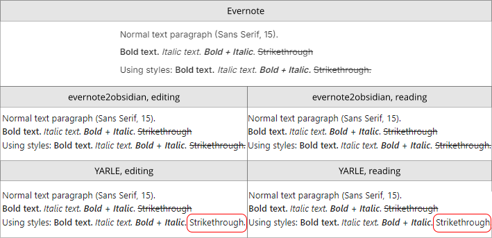

`evernote2obsidian`
- ✅ All data correctly converted.

YARLE
- ✅ Almost all data correctly converted.
- ❌ Didn't convert `<span style="text-decoration: line-through;">Strikethrough.</span>`.

</details>

<details>

<summary>020: Text formatting not fully supported in Markdown</summary>

Evernote formats notes using HTML, Obsidian uses Markdown - but Obsidian also supports some HTML as well.

One could simply put the same HTML from an Evernote note into Obsidian and call it a day. It would _look_ mostly fine, but would be a nightmare to edit in Obsidian! A middle ground would be to convert the HTML to Markdown when possible, and use _some_ HTML only when necessary. Of course, this can be a matter of taste for some users (some might prefer to not use HTML at all), but I think it is a good compromise most of the time.

So, in this more complex test, no program produced a perfect conversion in both views, but `evernote2obsidian` got a perfect score only in reading view. It seems that, in editing view, Obsidian can't display a mix of Markdown and HTML the same way it does in reading view, and I don't know any workaround to get a better result in editing view (except using even more HTML instead of Markdown, which I think is not a good idea).

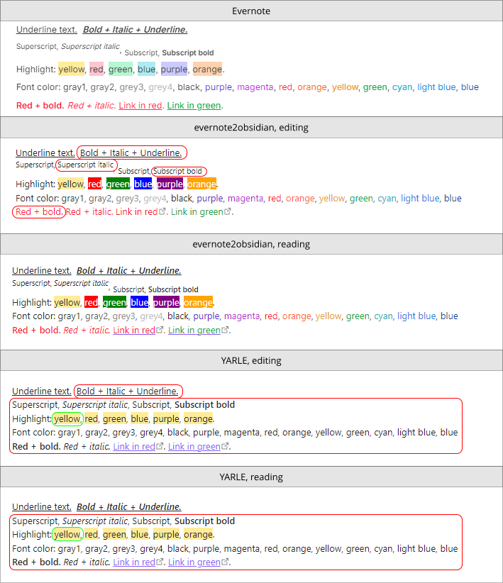

`evernote2obsidian`
- ✅ "Perfect" in reading mode only.
- ❌ Mixed Markdown and HTML doesn't show up correctly in editing view (due to Obsidian).

YARLE
- ✅ Converts basic HTML to Markdown (bold, italic, highlight), and also uses HTML `<u>` to underline text.
- ❌ Don't convert superscript, subscript, highlight colors (except yellow), font colors.

</details>

<details>

<summary>030: Text alignment</summary>

As far as I know, Markdown doesn't support text alignment, but Obsidian supports alignment with HTML.

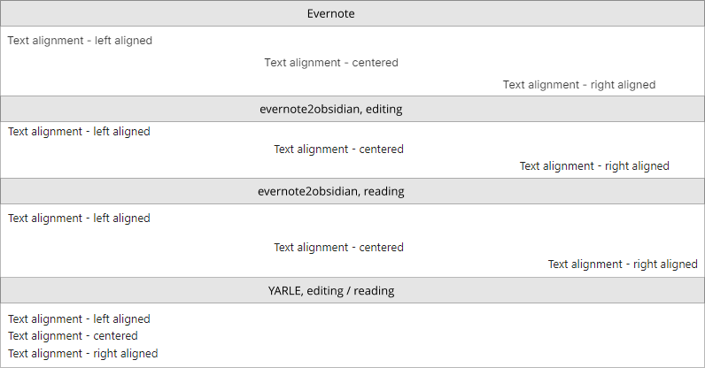

✅ `evernote2obsidian`: preserved text alignment.

❌ YARLE: lost text alignment.

</details>

<details>

<summary>040: Text indentation</summary>

As far as I know, Markdown doesn't support text indentation. Oddly enough (and fortunately!), Obsidian does, but only in editing mode.

One issue is that in Markdown, a line indented after a blank line becomes a "code block" (as seen in the last line in the screenshot).

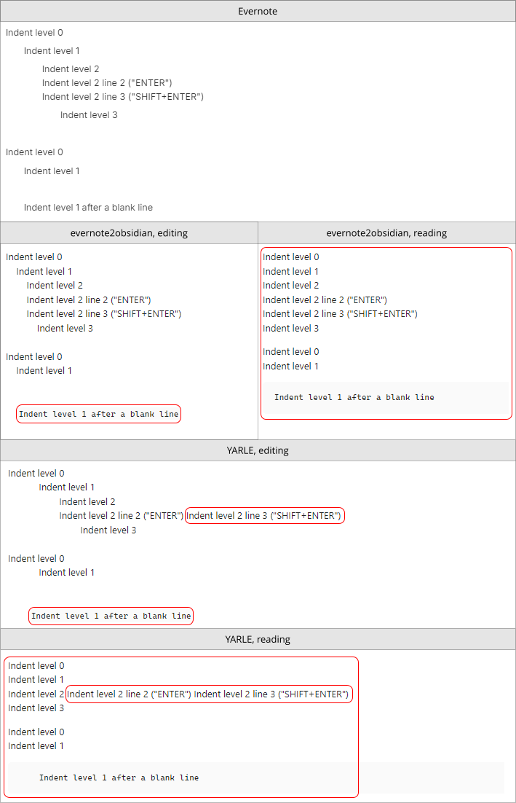

`evernote2obsidian`
- ✅ Almost all indentation is preserved.
- ❌ "Indent level 1 after a blank line" appears as a code block. There are some ugly possible workarounds, but I think this is one of those cases where it is best for the user to fix it in Obsidian (or even in Evernote, before exporting), possibly deleting the empty line above, or converting the indentation lines into bullets, if it is a viable alternative.

YARLE
- ✅ Most of the indentation is preserved.
- ❌ Error parsing multiple lines with same indentation (in "indent level 2"). "Indent level 1 after a blank line" appears as a code block.

Obsidian
- ❌ No indentation at all in reading view.

</details>

<details>

<summary>050: Font Families, Sizes</summary>

Another feature not directly supported by Markdown and Obsidian. Yes, one could use HTML to set font type and size, but you better do this manually and sparingly. From my tests, notes that came from different versions of Evernote (including mobile) can have a large mix of different fonts types and sizes, and it makes no sense to perpetuate that madness from Evernote into Obsidian.


❌ `evernote2obsidian`: formatting not supported (on purpose).

❌ YARLE: formatting not supported.

</details>

<details>

<summary>060: Bullet and Check Lists</summary>

Both programs did well, but missed a thing or two. YARLE use TABS for indentation, I chose to use spaces (I don't remember why now), and Obsidian might not show a bullet if you "skip" an indentation level using spaces.

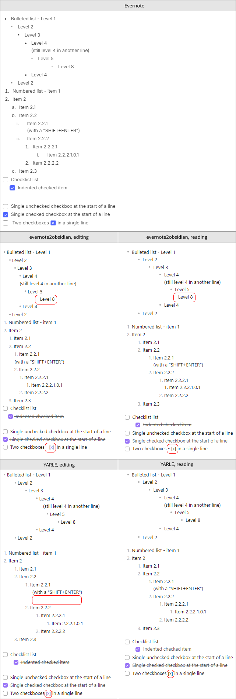

❌ `evernote2obsidian`
- ✅ Preserved most of the formatting.
- ❌ Missing bullet in "Level 8".

❌ YARLE
- ✅ Preserved most of the formatting.
- ❌ Added a blank line.

Obsidian
- ❌ Can't have two checkboxes in a single line.

</details>

<details>

<summary>070: Images</summary>

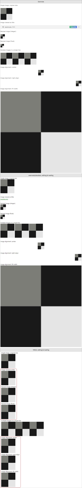

Evernote had many versions on many platforms, and some of them had their own quirks. For instance, I have notes with images that are embedded in base64 (``), but I couldn't find how to reproduce that in a new note. Anyway, that is another case in which `evernote2obsidian` works well, too.

✅ `evernote2obsidian`: preserved all formatting.

❌ YARLE: can't resize images, can't show them as "title" (link), can't center, can't right-align, can't fill width.

</details>

<details>

<summary>080: Divider</summary>

It's so simple and works so well that it doesn't deserve a screenshot!

✅ `evernote2obsidian`

✅ YARLE

</details>

<details>

<summary>090: Internal links / Links to local notes</summary>

This is a tricky one. If you find any explanation (or all of them) too confusing, I apologize, but keep on reading.

1) YARLE can't (for now) always correctly convert internal links

Depending on how you format your note links in Evernote, YARLE might or might not recreate them correctly in Obsidian. In my case, perhaps half of the links were broken (i.e., pointed to a non-existing note or to a wrong note). This happens for several reasons:
- YARLE imports data from .enex files, but Evernote doe not include in them the note IDs, an information required to correctly create links between notes.
- In Obsidian, a link to a note is just the path for that note, and the note "title" is the file name (minus the `.md` extension).
- YARLE has no other option but "guess" and convert a link by pointing to a note whose title is the same as the text in the link.
- In Evernote, if you create a link to a note and then either rename the note or rename the link, YARLE won't be able to correctly convert those links using the procedure described above.
- If a note title has an invalid file name or is for any reason renamed by YARLE during conversion, it might also not have correct links for it.

YARLE provides instructions to work around those issues (or at least some of them):

> In order to minimize the wrong conversion of links due to duplicated note names, you need to do the followings:
> 
> 1. Before export your notes: select all withing a notebook
> 2. Create a Table of Contents note
> 3. Export the notebook together with the TOC file
> 4. Start yarle and convert your notes

But there are still several problems with this approach:
- Those instructions are incomplete. I had to search the repository to find this: "Table of contents can be created in EN v10+ if you select all of your notes, then right click and choose `Copy internal links` then `Copy app links`. Then create a new note, title MUST BE: Table of Contents, and paste the internal links into the note's body. That's all". And yet, these somewhat confusing instructions might be obsolete due to changes in recent versions of Evernote.
- Evernote allows you to select only up to 100 notes at once, so those (like me) with many hundreds of notes in a notebook (and/or dozens of notebooks) would need to do a lot of scrolling, selecting, clicking, copying and pasting.
- Those manual and tedious operations must be repeated many times, which is ground for user errors.
- If the "Table of Contents" note is used just to provide a link between a note id and a note title, you can still have wrong links if you have notes with the same title.
- According to issue [Add support for new Evernote Note Link format #655](https://github.com/akosbalasko/yarle/issues/655), opened in Nov. 2024, Evernote started using a new format when you create note links, and YARLE still doesn't support it (more details below).

2) Evernote supports at least 3 types of internal links:
- "Internal link" (`evernote:///view/123456/s51/xxxxxxxx-xxxx-xxxx-xxxx-xxxxxxxxxxxx/yyyyyyyy-yyyy-yyyy-yyyy-yyyyyyyyyyyy/`)
- "Note link" (`https://share.evernote.com/note/xxxxxxxx-xxxx-xxxx-xxxx-xxxxxxxxxxxx`)
- "Shard link" (`https://www.evernote.com/shard/s51/nl/1234567/xxxxxxxx-xxxx-xxxx-xxxx-xxxxxxxxxxxx`)

As of this writing, YARLE does not convert the "note link" URL. It just keep the URL as-is, which turns it into an external link pointing to the Evernote site.

It was mainly for those reasons that I created `evernote2obsidian`. It reads data not from .enex files, but directly from the [evernote-backup](https://github.com/vzhd1701/evernote-backup/) database. And recently it got a new feature to export the notes IDs in .enex files using a non-standard tag ([[Feature request]: Provide a way to write note guid into exported .enex #66](https://github.com/vzhd1701/evernote-backup/issues/66)). This means that, if you export your data with `evernote-backup` to .enex files including that tag, and a new version of YARLE supports this feature, it might be able to (at least in theory) always correctly convert all note links.

By the way, you might have noticed that internal links appear in green in the screenshots. This is not by default. You can apply custom CSS snippets in Obsidian, and I use the following one to more easily differentiate between internal and external links:
```css
span.cm-hmd-internal-link a, .internal-link {
    color: green !important;
}
```

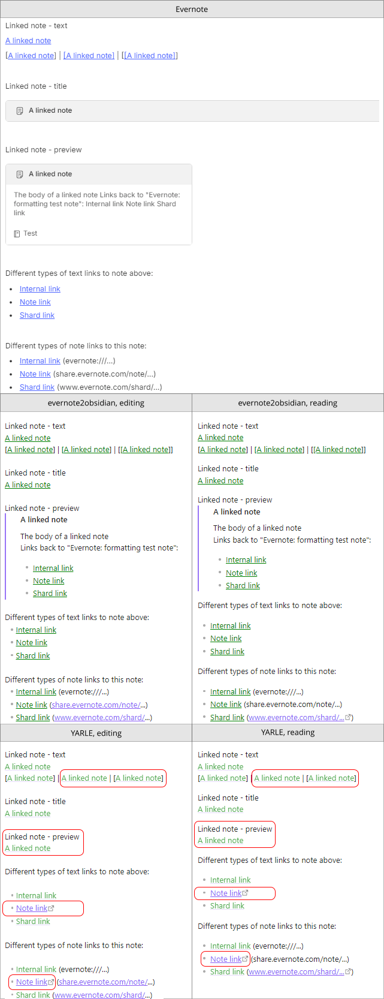

`evernote2obsidian`
✅ Preserved all links in both editing and reading views, preserved all formatting in reading view.
❌ Square brackets don't show up correctly in links in editing view. Could be an Obsidian issue, since it works fine in reading view.

❌ YARLE: don't show previews, don't convert all URLs formats, can create many broken links, don't escape square brackets properly.

</details>

<details>

<summary>100: External Links</summary>

YARLE converts external links just fine in most cases, but I noticed a few occasions where a possible bug in Obsidian might cause issues rendering the Markdown link - in this example, a link containing parentheses ([http://en.wikipedia.org/wiki/Copula_(linguistics)](http://en.wikipedia.org/wiki/Copula_(linguistics))), in italics, inside a table cell. Yep, I had that in a note!

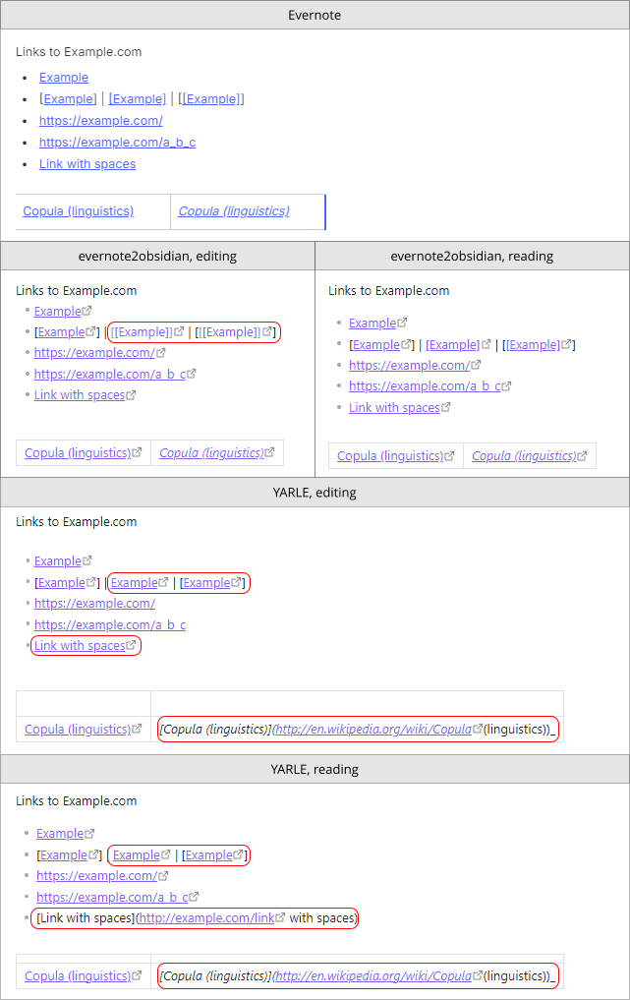

`evernote2obsidian`
✅ Preserved all formatting in reading view.
❌ Square brackets don't show up correctly in links in editing view. Could be an Obsidian issue, since it works fine in reading view.

❌ YARLE: fails with links containing spaces, not just visually (as seen in reading view), but the link in the editing view is also broken. Can have issues in some other edge cases, as seen in the Wikipedia link (that could be an Obsidian bug as well). Don't escape square brackets properly.

</details>

<details>

<summary>110: Table</summary>

This is a somewhat large and complex test, but the TL;DR is that in Markdown you can't have merged cells, cells with custom background color, or cells with custom text alignment (but you can have a "column" alignment).

In the image below you have columns A, B, and C, and rows from 1 to 15. I did this so you can see how your data can "drift" in a table when you have merged cells. Comments about some of the affected cells:

- A3 + B3: in Evernote, cells A3 and B3 are horizontally merged. Since you can't have merged cells in Markdown tables, both conversion programs puts the same content in Markdown cell A3, leaves B3 empty, and puts the correct content in C3.
- A4 + A5: in Evernote, cells A4 and A5 are vertically merged. `evernote2obsidian` puts the content in A4, leaving A5 empty. YARLE ends up "drifting" the cells, putting B5 and C5 in wrong columns (A5 and B5, respectively).
- C7 + C8: also drifted in YARLE (to B7)
- C11: drifted in YARLE (to A11)

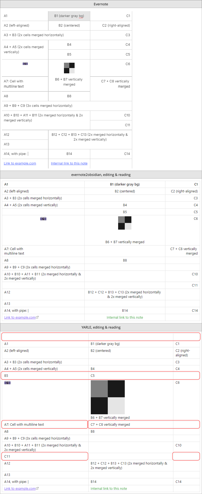

`evernote2obsidian`
- ✅ Can preserve most data in tables, including some of the alignment in a column. "Correctly" (or as correctly as possible) deals with cells merged horizontally and vertically. Supports multiline text in cells.
- ❌ Can't overcome the Markdown / Obsidian issues listed below.

YARLE
- ✅ Can preserve most data in simple tables, even with horizontally merged cells.
- ❌ Add an extra, empty row at the top of each table. Doesn't support alignment at all. Might "move" the content of cells in tables with cells merged vertically. Doesn't seem to support multiline text in cells (see cell A7). Can't overcome the Markdown / Obsidian issues listed below.

Markdown / Obsidian
- ❌ Can't set a cell background color. Can only provide one alignment per column, not per cell. 

</details>

<details>

<summary>120: Quotes</summary>

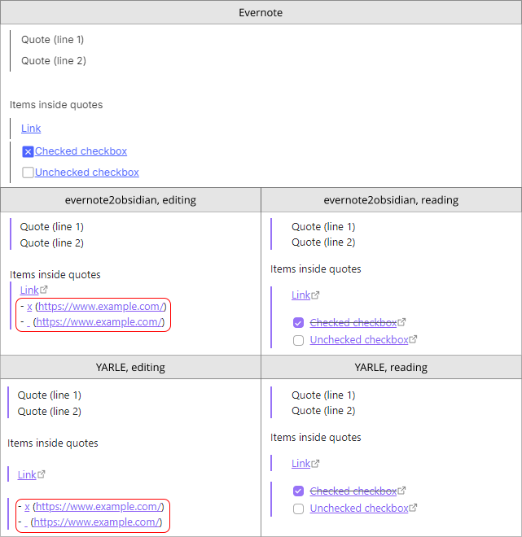

In previous Evernote versions, you could have nested quotes (a quote inside another quote). Now even Evernote itself can't properly display nested quotes from those older notes, but `evernote2obsidian` convert them just fine. It seems we can't create those anymore in Evernote, though.

`evernote2obsidian`
- ✅ Preserved all formatting in reading view. Also works with nested quotes.

YARLE
- ✅ Preserved all formatting in reading view. Also works with nested quotes.

Markdown / Obsidian
- ❌ Can't show checkboxes (and perhaps other content, at least links after checkboxes) in quotes in editing view.

</details>

<details>

<summary>130: Code Blocks</summary>

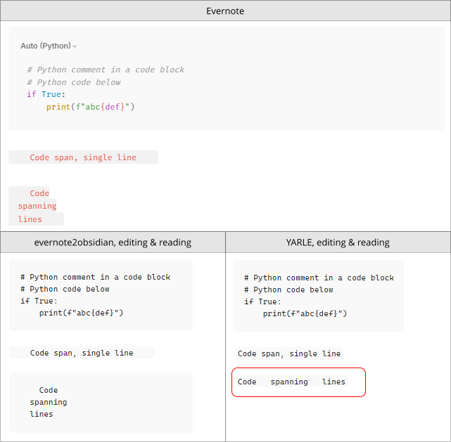

`evernote2obsidian`
- ✅ Preserved all formatting.

YARLE
- ✅ Preserved most formatting.
- ❌ Don't properly convert a multiline code span.

</details>

<details>

<summary>140: Attachments: PDFs, Audio, Video</summary>

Another long image! But this one shows a cool thing Obsidian can do that Evernote apparently can't: play an embedded video.

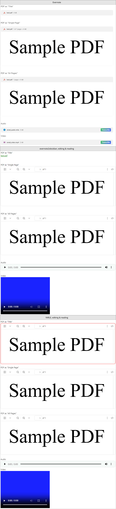

`evernote2obsidian`
- ✅ Preserved all formatting.

YARLE
- ✅ Preserved almost all formatting.
- ❌ Can't show an attachment as "title" (or as a link)

</details>

<details>

<summary>150: Table of Contents</summary>

Obsidian can show a table of contents (TOC) in a separate pane, but can't embed one in the note. While a copy of the original TOC could be created during conversion, it wouldn't be automatically updated, so I think there is no point doing that. `evernote2obsidian` will at least leave a note saying that the TOC was removed and how you can get the same data in Obsidian.

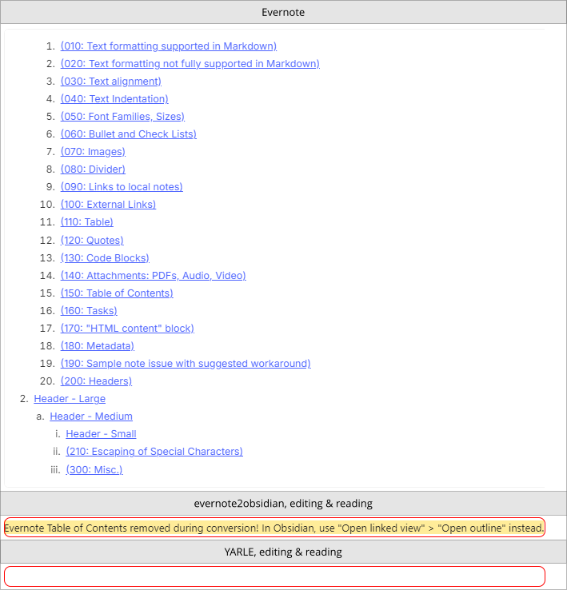

`evernote2obsidian`
- ✅ Shows that the TOC was removed, and tells how to open the Obsidian outline.
- ❌ Won't show an embedded TOC.

YARLE
- ❌ Doesn't show anything at all.

</details>

<details>

<summary>160: Tasks</summary>

Evernote has a feature called "tasks". It has many options, such as due date, recurring, reminders, and more. Obsidian doesn't have that feature, so the only thing a converter can do (except if you want to implement that feature with a plugin) is to "paste" the task as text, so the user can see it and perhaps move it to a calendar or some other software.

To be able to convert tasks, you need to invoke `evernote-backup` with `--include-tasks --token <your token>`. See the documentation for more details.

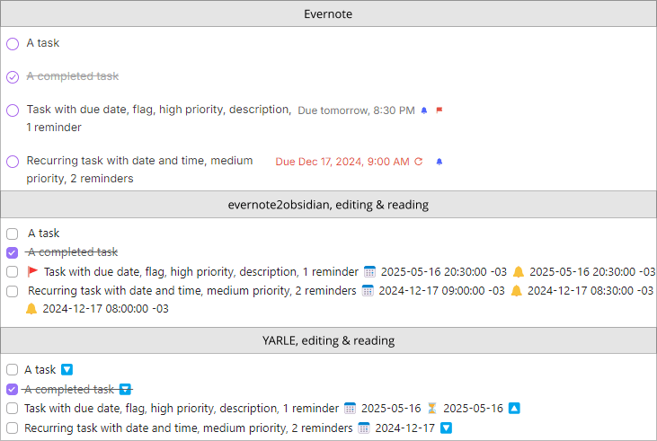

`evernote2obsidian`
- ✅ Shows task name, flag, due date and time with time zone, reminders.
- ❌ Doesn't show task priority, creator, assignee, description, if task is due.

YARLE
- ✅ Shows task name, "flag" (as 🔼 instead of 🔽), due date.
- ❌ Doesn't time in due date, doesn't show task priority, creator, assignee, description, if task is due, reminders.

</details>

<details>

<summary>170: "HTML content" block</summary>

When Evernote find content in a note it can't properly render without using an iframe, it shows it inside an "HTML content" block (more precisely, it renders it in a `<foreign-content>` element). They are not editable, and you can only simplify its formatting (so they become editable but lose formatting) or remove the block. I found them mostly in old notes with content imported from websites or e-mails.

There ain't much to be done during conversion. Ideally, you should detect these blocks before conversion and choose the best way to deal with them. `evernote2obsidian` can help you find at least some of them, but as I don't know  exactly what causes them, I'm sure it won't find all instances.

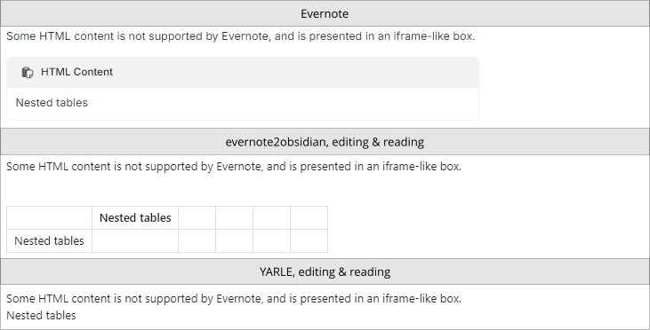

`evernote2obsidian`
- ✅ When you use "Scan selected notebooks for issues" from the main menu, some of those blocks can be found and listed, so you can fix them in Evernote.
- ❌ Can't correctly convert those blocks.

YARLE
- ❌ Can't correctly convert those blocks.

</details>

<details>

<summary>180: Metadata</summary>

Evernote notes can contain many metadata values, such as note creation and update date and time, URL, author,and tags. Here is how Obsidian display such data.

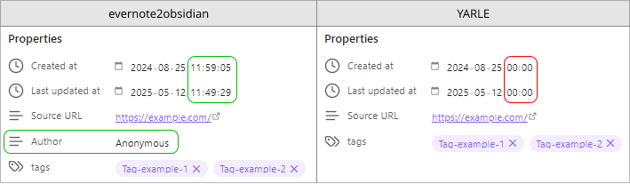

`evernote2obsidian`
- ✅ All data is being preserved (at least in this case - even though other metadata, such as latitude, longitude, lastEditedBy, and many more are not converted by default, if you need them you just need to search for the metadata field name in the source code and uncomment the specific line you need).

YARLE
- ✅ Most of the data was preserved.
- ❌ Didn't import `Author` nor time for the date / time fields.

</details>

<details>

<summary>190: Sample note issue with suggested workarounds</summary>

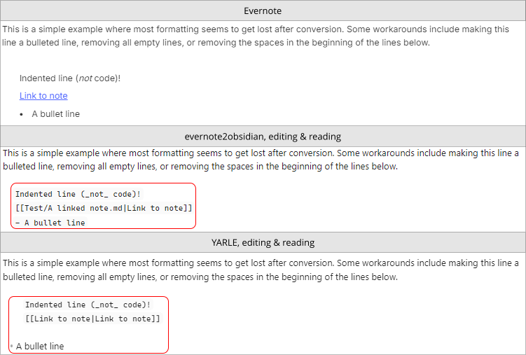

This is a common issue I found in many notes for which there is no single automatic solution for a formatting problem. As you can see, after a blank line, the indentation spaces in the next lines make them a code block in Obsidian. That is not a bug, it is just how Markdown works. In such cases, you can solve the formatting issue by removing the blank line(s), removing indentation, or by starting a bullet list in the "parent" line.

`evernote2obsidian`
- ❌ Can't solve this at all.

YARLE
- ❌ Can't solve this at all. And oddly enough, by mistakenly (or purposely?) adding an extraneous blank line above the last one, it correctly shows the bullet line...

</details>

<details>

<summary>200: Headers</summary>

As with "080: Divider", both programs got the same result, worth of just a few words and no image.

✅ `evernote2obsidian`

✅ YARLE

</details>

<details>

<summary>210: Escaping of Special Characters</summary>

To keep it "short", I didn't reproduce full screenshots here, I just highlighted the main issues, and it still the longest image in this document.

We need to escape special Markdown characters, or unintended formatting will happen. But just like using HTML, I think that escaping special characters should be done sparingly. On the other hand, not escaping all special characters might introduce issues. Like in many other cases, it is a compromise.


`evernote2obsidian`
- ✅ Produces a perfect result in editing mode, within the limits of this test (I'm sure it might fail in some specific situations).
- ❌ Since it doesn't escape _all_ underline characters, some text end up in italic in reading view when it shouldn't.

YARLE
- ✅ Escapes correctly most of the special characters.
- ❌ Doesn't escape equal signs, hashtags, `<` or `>` (which "disturbs" all rendering after it), dollar sign (`$`), percent sign (`%`), pipe (`|`).

</details>

### Conclusion

Converting from HTML to Markdown is easy. Cover all edge cases, work around bugs, make everything work in Obsidian in editing and reading views, preserve all formatting, among other things, can be challenging at best, or probably impossible. One potential exception to this is that Obsidian supports plugins, and there are already hundreds of them that enhances or changes how Obsidian works, adding features not originally supported by the program. No plugin was used or considered in this review, though.

If you are an Evernote user and want to move to Obsidian, I hope this document could give you an overview of the limitations of the process, and some understanding of the decisions and compromises I chose to make when creating `evernote2obsidian`.

As always, YMMV. Your data in Evernote can be very different than mine, so you might find other cases where `evernote2obsidian` also fails that were not listed in this document.

There is no perfect tool for converting your notes, but there might be one good enough for you. And no matter which tool or path you choose to convert your data, please always do a backup, and compare your data in Evernote and Obsidian before retiring the elephant.
